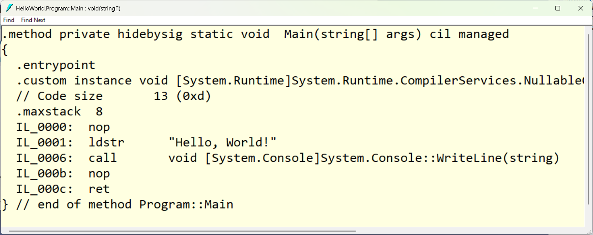
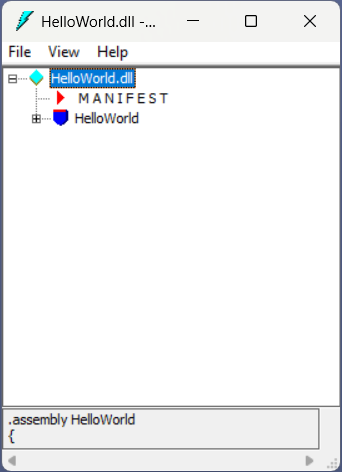
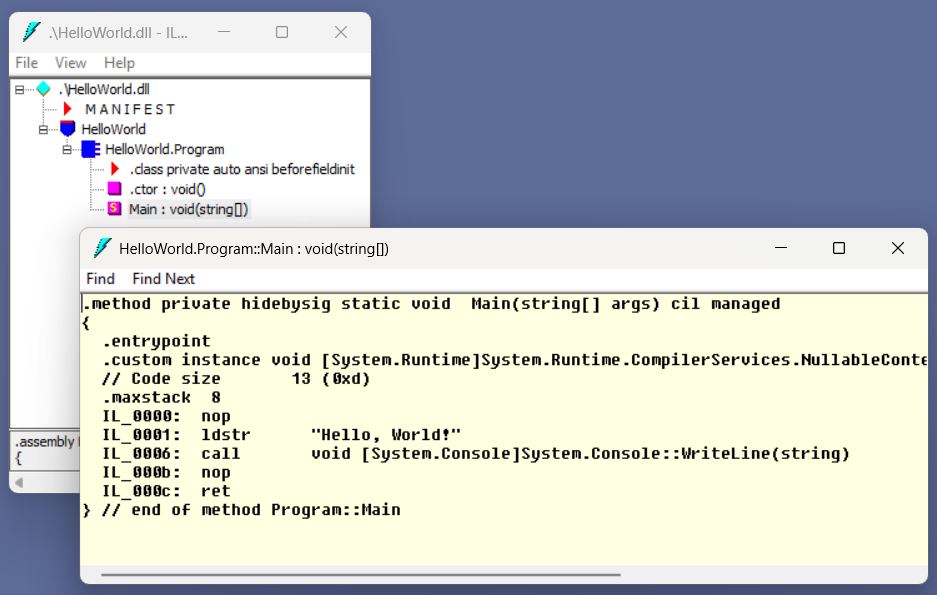
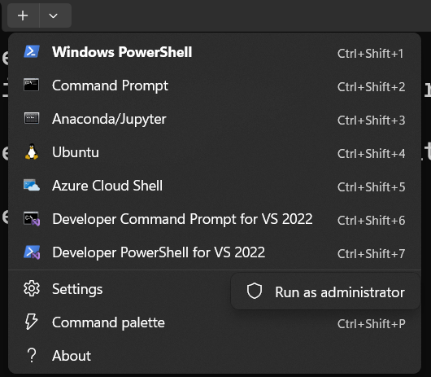
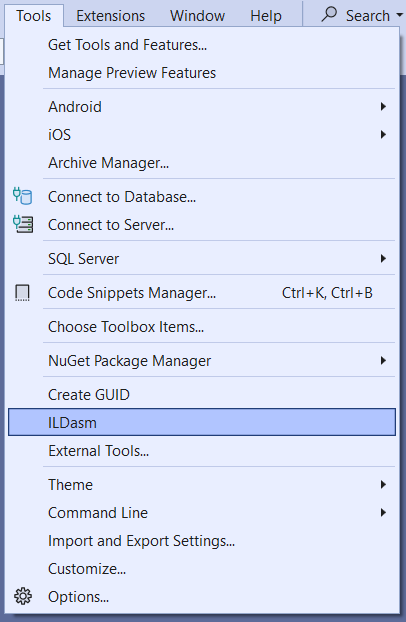
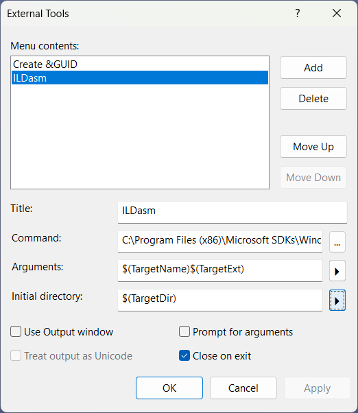
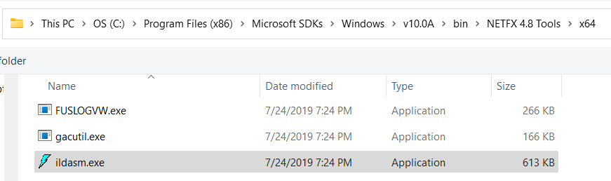
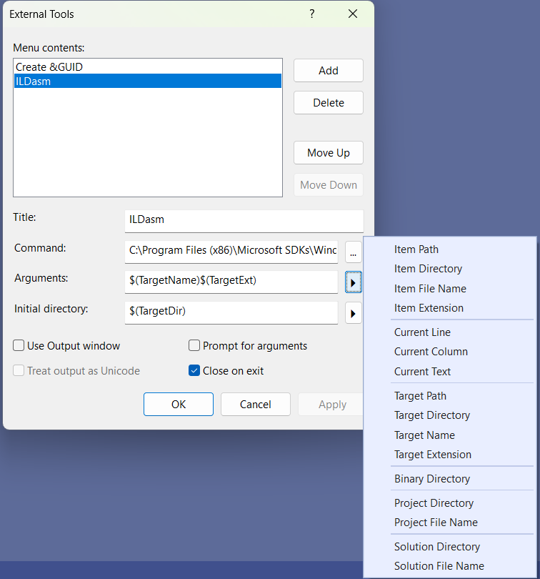
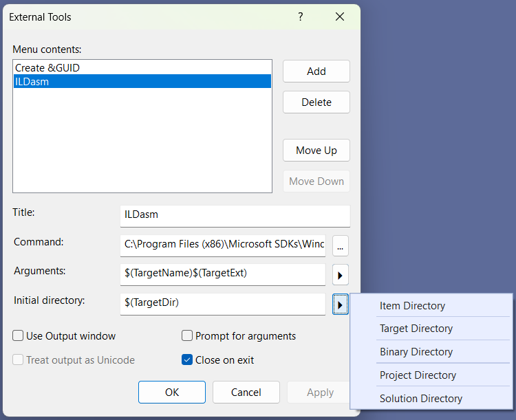
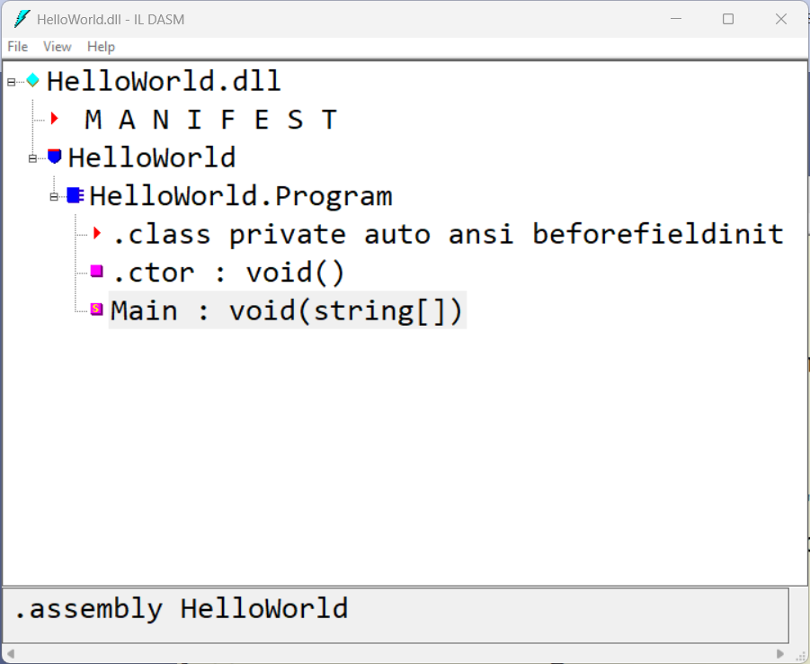

# Using ILDasm (Intermediate Language Disassembler) and Visual Studio 2022

ILDasm -- the intermediate language disassember -- tool lets us look at the code compiled by the .NET compiler. This tool is automatically included with Visual Studio and offers both command line and desktop output. This article will show how to configure the desktop version as an External Tool in Visual Studio 2022 and also show how to set the fonts.  

## The Tiniest Bit about IL (Intermediate Language)  

If you are not familiar with IL, it is an assembly-language-like intermediate between your favorite .NET language and the machine code that actually runs. The .NET runtime turns the IL into machine code.  

Here is a sample of a "Hello World" method.

```csharp
static void Main(string[] args)
{
    Console.WriteLine("Hello, World!");
}
```



I'm not here to teach IL, but I'll point out a couple of things. The "ldstr" is "load string", and it loads the "Hello, World!" string literal so that it can be used as an argument. Then "call" will execute the "Console.WriteLine" method with the loaded string as the argument.    

The nice thing about IL is that it is portable. You can take this .NET 9 console application compiled to IL and run it anywhere .NET 9 will run (Windows, macOS, Linux) -- as long as the .NET runtime is installed. 

> Note: Another option in .NET is to use Native AOT (Ahead-of-Time) Compilation. This creates an .exe that contains the native machine code (and not the IL). ILDasm will not work on these files.  

## Running ILDasm from a Visual Studio 2022 Developer Prompt  

The Visual Studio 2022 Developer prompt is a command prompt or PowerShell environment that has the path configured for Visual Studio developer tools (including ILDasm).  

1. From the Visual Studio 2022 menu, select Tools -> Command Line -> Developer PowerShell (or Developer Command Prompt).  

2. Navigate to a folder with a .NET .dll or .exe.  

This repository contains a sample console application (with the default "Hello, World!" function). Build this application, then navigate the command line to the output folder.  

Ex. ```D:\Apps\HelloWorld\bin\Debug\net9.0\```

3. Type ```ildasm .\HelloWorld.dll```

> Note: When looking at .NET 8/9 applications, always choose the ```.dll``` file; the ```.exe``` is just a wrapper. When looking at .NET Framework assemblies, choose the ```.exe``` file for the application. You can also open ```.dll``` library files.

4. You should see the initial tree view.  



5. Expand the "HelloWorld" node on the bottom, then the "HelloWorld.Program" node, then double-click on "Main". This will open a disassembly of the Main method.  



As you'll notice, this is an old tool, but it still works on .NET 9 assemblies.  

> **Important**  
ILDasm locks the current file that it has open. So if you try to build the project with ILDasm open, the build will fail because it cannot replace the output file. Be sure to close ILDasm between builds.  

One problem is the fonts. The "View" menu allows you to set the fonts. The problem is that the **font settings are not saved** unless you run the tool as administrator.  

Let's fix the fonts.  

## Setting the Fonts  

You'll need to run ILDasm as an administrator. One way to do this is to open the Developer PowerShell prompt as administrator.  

1. If you are using Windows Terminal (and if you're not, I'd highly recommend it), you can click on the down-arrow to open a new tab or window.  

2. You'll see "Developer PowerShell for VS 2022" and "Developer Command Prompt for VS 2022" as options.  

3. Right-click "Developer PowerShell for VS 2022" and choose "Run as Administrator".  



4. As above, navigate to a folder with a .NET .dll or .exe.  

5. Type ```ildasm``` along with the name of the assembly (.dll or .exe).  

6. From the "View" menu, you can change the fonts for the "Tree view" and the "Disassembly".  

7. When you close the application, the fonts are saved as the default.  

The next time you open the application (whether or not you run as administrator), the new fonts will be used.  

## Setting up ILDasm as an External Tool in Visual Studio  

Something I find really handy is to set up ILDasm as an External Tool in Visual Studio. Instead of using the command line, I can open the current project in ILDasm with just a menu selection.  



1. From the "Tools" menu, select "External Tools".  



2. Click "Add".  

3. For Title, use "ILDasm" or whatever you like. This is what will appear on the "Tools" menu.  

4. For Command, click the dialog button, and locate "ildasm.exe"  



The path may vary depending on your installation. I am running Windows 11 with .NET 4.8 installed, so my path is as follows:  

```
C:\Program Files (x86)\Microsoft SDKs\Windows\v10.0A\bin\NETFX 4.8 Tools\x64\ildasm.exe
```

The "v10.0A" refers to my version of Windows.  

The "NETFX 4.8 Tools" refers to my version of .NET Framework.  

> Note: The "x64" at the end of the path is very important. There is a 32-bit version ildasm.exe in the "NETFX 4.8 Tools" folder, but it won't work right here.  

5. Click the "ildasm.exe" file, then the "Open" button.  

6. For Arguments, use the arrow button to help you fill in values.  

  

7. In the pop-up, select "Target Name", click the button again, and select "Target Extension".  

This will set up variables to open the current project. For example, if you are in a console applicaton project called "HelloWorld", it will set the argument to the target (output) name "HelloWorld" and the output extension (.dll):  "HelloWorld.dll".  

8. For Initial directory, use the arrow button to choose "Target Directory".  

  

This will set the working path to the target (output) directory.

Ex: ```D:\Apps\HelloWorld\bin\Debug\net9.0\```  

The good thing about this is if you change from Debug to Release or update the version of .NET, the you do not need to make any changes to this tool. It will use the appropriate output directory.  

9. Click "OK" to finish setting up the External Tool.  

10. In Visual Studio, open a project (such as the sample "HelloWorld" project).

11. From the menu, choose "External Tools", then "ILDasm".  

This will open the current project in ILDasm.



> Note: "Current Project" is determined by which project is selected in the Solution Explorer. So if you have a class file selected in the Solution Explorer, the external tool will open up that class library.  

As a reminder, ILDasm locks the current file. So you will need to close ILDasm before building the current project. With ILDasm set up as an external tool, it is really easy to reopen the project after it is rebuilt.  

---END---

---